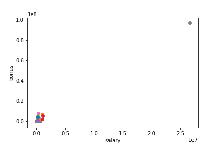
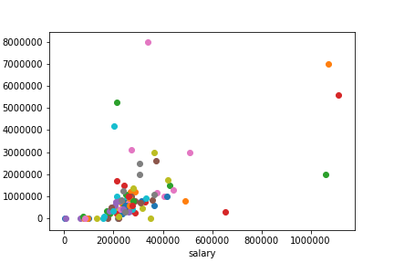
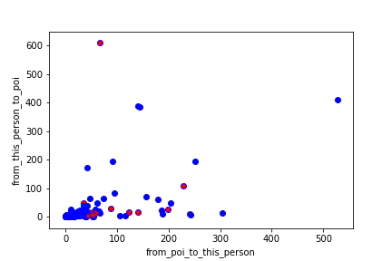
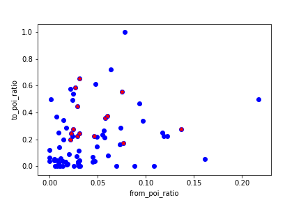
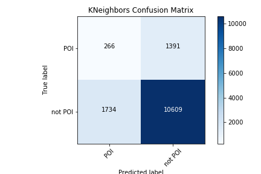
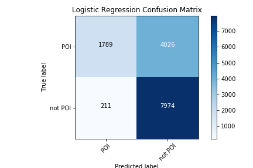

## Identifying fraudsters at Enron

#### Supervised Machine Learning in Python using scikit-learn

##### by cbkrol

### Enron

In 2000, Enron was one of the largest companies in the United States. By 2002, it had collapsed into bankruptcy due to widespread corporate fraud. In the resulting Federal investigation, a significant amount of typically confidential information was entered into public record, including tens of thousands of emails and detailed financial data for top executives. In addition, a hand-generated list of persons-of-interest in the fraud case was compiled, these are individuals who were indicted, reached a settlement, or plea deal with the government, or testified in exchange for prosecution immunity.

#### Identifying fraudsters

This project builds a person-of-interest (POI) identifier based on financial and email data made public as a result of the Enron scandal.
The model is built by **"learning"** from data where each employee is labelled as POI or not-POI. The model can then be used with data for  employees that it has not seen before and deliver a prediction of POI or not-POI.

#### Classification using Machine Learning

In supervised machine learning, an identifier or classifier is an algorithm used to identify to which category a new observation belongs, it does so by learning first from a set of training observations whose category membership is known.[ref 1][1] 

The end-to-end process of investigating data through a machine learning lens is covered. We explore the dataset to develop intuition about relevant metrics and find potential anomalies in the data. We study the different pieces of information or features available to represent each employee to determine which are most useful to predict the likelyhood that this person is a POI. We compare, validate and choose a classification algorithm from the scikit-learn library and tune its parameters to optimize the model.

[1]: https://en.wikipedia.org/wiki/Statistical_classification "Statistical classification"  

### Preprocessing

#### Enron Dataset Overview

The aggregated Enron email and financial dataset contains 146 entries keyed on a person's name and followed by all the information for that person. The dataset contains 18 entries labelled as POI and 128 as non-POI.

There are 21 features for each person: 

- first is the label indicating POI or not
- 14 features reflect financial information such as salary, bonus, exercised stock options etc. 
- 6 features summarize for this person the findings from the email corpus,  they provide the person's email address as well as total number of emails sent/received and the number of emails sent/received to/from persons of interest. 

#### Outliers

Exploring the dataset revealed an extreme outlier in the financial data, upon further investigation this entry turned out to be an anomaly introduced by the use of a spreadsheet as it captured salary and bonus information for TOTAL as if this were an employee.  This entry was removed.

Salary and Bonus before and after dropping this outlier:

<table><tr><td></td><td></td></tr></table>

#### Sparse Data

Although this large dataset includes approximately 500 000 emails from Enron employees, it contains entries for only 18 persons of interest out of a possible 35 identified during the investigation.

As some emails may have been deleted or financial information not been made available, many employee entries do not contain values for some of the features.  The number of valid data points for each feature are listed below.

Note: when all selected features for an employee entry were nil, that entry was omitted from the dataset to train the classifier.

<table>
  <tbody><tr>
    <td><b>Feature</b></td>
    <td><b>Number of valid data points</b></td>
  </tr>
  <tr>
    <td>Total Stock Value</td>
    <td>125</td>
  </tr>
  <tr>
    <td>Total Payments</td>
    <td>124</td>
  </tr>
   <tr>
    <td>Restricted Stock</td>
    <td>109</td>
  </tr>
  <tr>
    <td>Exercised Stock Options</td>
    <td>101</td>
  </tr>
  <tr>
    <td>Expenses</td>
    <td>94</td>
  </tr>
  <tr>
    <td>Salary</td>
    <td>94</td>
  </tr>
  <tr>
    <td>Other</td>
    <td>92</td>
  </tr>
  <tr>
    <td>From Messages</td>
    <td>86</td>
  </tr>
  <tr>
    <td>From POI to this person</td>
    <td>86</td>
  </tr>
  <tr>
    <td>From this person to POI</td>
    <td>86</td>
  </tr>
  <tr>
    <td>Shared Receipt with POI</td>
    <td>86</td>
  </tr>
  <tr>
    <td>To Messages</td>
    <td>86</td>
  </tr>
  <tr>
    <td>Bonus</td>
    <td>81</td>
  </tr>
  <tr>
    <td>Long Term Incentive</td>
    <td>65</td>
  </tr>
  <tr>
    <td>Deferred Income</td>
    <td>48</td>
  </tr>
  <tr>
    <td>Deferral Payments</td>
    <td>38</td>
  </tr>
  <tr>
    <td>Restricted Stock Deferred</td>
    <td>17</td>
  </tr>
  <tr>
    <td>Director Fees</td>
    <td>16</td>
  </tr>
  <tr>
    <td>Loan Advances</td>
    <td>3</td>
  </tr>
</tbody></table>

#### Feature extraction  - engineering new features 

Reading about the Enron scandal, human intuition leads us to consider whether a POI would likely exchange more emails with other POIs relative to emails to other employees. 

A scatterplot of the number of messages sent to and received from POIs shows that these features may not be all that useful to separate the POIs (in red) from the general population.

Scaling this information by computing the number of emails sent to or received from a POI divided by the total number of emails this person sent or received provided more useful features. 

Both of these new features were added to the dataset for further evaluation during feature selection.

<table><tr><td></td><td></td></tr></table>

### Dimensionality reduction

Reducing the number of random variables to consider.

#### Feature selection

SelectKBest from sklearn.feature_selection was used as a preliminary step to determine the importance of the top 20 features and generated the following scores. 

<table>
  <tbody><tr>
    <td><b>Feature</b></td>
    <td><b>Score</b></td>
  </tr>
  <tr>
    <td>exercised_stock_options</td>
    <td>25.0975</td>
  </tr>
  <tr>
    <td>total_stock_value</td>
    <td>24.4676</td>
  </tr>
   <tr>
    <td>bonus</td>
    <td>21.0600</td>
  </tr>
  <tr>
    <td>salary</td>
    <td>18.5757</td>
  </tr>
  <tr>
    <td>to_poi_ratio</td>
    <td>16.6417</td>
  </tr>
  <tr>
    <td>deferred_income</td>
    <td>11.5955</td>
  </tr>
  <tr>
    <td>long_term_incentive</td>
    <td>10.0724</td>
  </tr>
  <tr>
    <td>restricted_stock</td>
    <td>9.3467</td>
  </tr>
  <tr>
    <td>total_payments</td>
    <td>8.8667</td>
  </tr>
  <tr>
    <td>shared_receipt_with_poi</td>
    <td>8.7464</td>
  </tr>
  <tr>
    <td>loan_advances</td>
    <td>7.2427</td>
  </tr>
  <tr>
    <td>expenses</td>
    <td>6.2342</td>
  </tr>
  <tr>
    <td>from_poi_to_this_person</td>
    <td>5.3449</td>
  </tr>
  <tr>
    <td>other</td>
    <td>4.2049</td>
  </tr>
  <tr>
    <td>from_poi_ratio</td>
    <td>3.2107</td>
  </tr>
  <tr>
    <td>from_this_person_to_poi</td>
    <td>2.4265</td>
  </tr>
  <tr>
    <td>director_fees</td>
    <td>2.1076</td>
  </tr>
  <tr>
    <td>to_messages</td>
    <td>1.6988</td>
  </tr>
  <tr>
    <td>deferral_payments</td>
    <td>0.2170</td>
  </tr>
  <tr>
    <td>from_messages</td>
    <td>0.1641</td>
  </tr>
</tbody></table>

As the values in this dataset vary greatly in range depending on the feature, MinMaxScaler from sklearn.preprocessing was used to scale all features.  

SelectKBest and GridSearchCV were then used together using a Pipeline and three different classifier algorithms, results were compared using k = 4, 5, 6, 10, 20 features, the best results were obtained with k = 5.  

A notable difference was seen with only 4 features as the first 4 features do not contain any email related fields. The addition of the 5th feature introduces email related data and increased scores very significantly. Introducing additional features beyond the 5th decreased the scores further or had little impact.

The final set of features selected for the POI identifier are:

<table>
  <tbody>
  <tr>
    <td><b>Feature</b></td>
    <td><b>Score</b></td>
  </tr>
  <tr>
    <td>exercised_stock_options</td>
    <td>25.0975</td>
  </tr>
  <tr>
    <td>total_stock_value</td>
    <td>24.4676</td>
  </tr>
   <tr>
    <td>bonus</td>
    <td>21.0600</td>
  </tr>
  <tr>
    <td>salary</td>
    <td>18.5757</td>
  </tr>
  <tr>
    <td>to_poi_ratio</td>
    <td>16.6417</td>
  </tr>
  </tbody>
 </table>
 
 This feature set includes one of the newly created feature, to_poi_ratio.

### Model selection

Comparing, validating and choosing parameters and models.

#### Algorithms and Cross-validation

The dataset was split randomly into 70% training data and 30% test data using train_test_split. A pipeline was used in combination with GridSearchCV to evaluate the results of three different algorithms: 
- **DecisionTreeClassifier**, 
- **KNeighborsClassifier** and 
- **LogisticRegression**.

A classic mistake in machine learning is to split the dataset into training and testing data without shuffling, if the data happens to be sorted one can end up with a training set containing elements from one class while the test set contains mostly elements from another class producing invalid results.

To verify the results of our classifiers, cross-validation was done by iterating over 25 randomized splits of the training and testing data and averaging the resulting accuracy, precision and recall scores.

#### Tuning the hyper-parameters

Hyper-parameters are parameters that are not directly learnt within estimators. In scikit-learn they are passed as arguments to the constructor of the estimator classes. [ref 2][2] To tune the algorithms i.e. to find the best values for parameters to provide the best possible results for this dataset, all permutations of the following parameter values were tested for each corresponding algorighm type.

<table>
  <tbody>
  <tr>
    <td><b>Classifier</b></td>
    <td><b>Parameter</b></td>
    <td><b>Values Tested</b></td>
  </tr>
  <tr>
    <td>DecisionTree</td>
    <td>criterion</td>
    <td>gini, entropy</td>
  </tr>
  <tr>
    <td>DecisionTree</td>
    <td>min_sample_split</td>
    <td>10, 15, 20, 25</td>
  </tr>
  <tr>
  <tr>
    <td>KNeighbors</td>
    <td>n_neighbors</td>
    <td>1-6</td>
  </tr>
  <tr>
    <td>KNeighbors</td>
    <td>weights</td>
    <td>uniform, distance</td>
  </tr>
  <tr>
    <td>KNeighbors</td>
    <td>algorithm</td>
    <td>ball_tree, kd_tree, brute, auto</td>
  </tr>
  <tr>
    <td>LogisticRegression</td>
    <td>C</td>
    <td>0.05, 0.5, 1, 10, 10^2, 10^3, 10^5, 10^10, 10^15</td>
  </tr>
  <tr>
    <td>LogisticRegression</td>
    <td>tol</td>
    <td>10^-1, 10^-2, 10^-4, 10^-5, 10^-6, 10^-10, 10^-15</td>
  </tr>
  <tr>
    <td>LogisticRegression</td>
    <td>class_weight</td>
    <td>balanced</td>
  </tr>
  </tbody>
</table>

[2]: http://scikit-learn.org/stable/modules/grid_search.html "Tuning the hyper-parameters of an estimator"

GridSearchCV was used with the training portion of the dataset to cycle through all parameter combinations, **best_estimator_** was used to obtain the best classifier of this type and **best_params_** provided the associated parameter settings.

The chosen classifier was then used to predict results for the test portion of the dataset and to compute the resulting precision, recall and accuracy scores for this classifier.  The results obtained were as follows:

<table>
  <tbody>
  <tr>
    <td><b>Classifier</b></td>
    <td><b>Parms</b></td>
    <td><b>Accuracy</b></td>
    <td><b>Precision</b></td>
    <td><b>Recall</b></td>
    <td><b>balanced F-score</b></td>
  </tr>
  <tr>
    <td>KNeighbors</td>
    <td>n_neighbors=1</td>
    <td>.77</td>
    <td>.16</td>
    <td>.13</td>
    <td>.14</td>
  </tr>
  
  <tr>
    <td>DecisionTree</td>
    <td>criterion=entropy, split=10</td>
    <td>.80</td>
    <td>.31</td>
    <td>.31</td>
    <td>.31</td>
  </tr>
  
  <tr>
    <td>Logistic Regression</td>
    <td>C=0.05, tol=0.1, balanced</td>
    <td>.68</td>
    <td>.29</td>
    <td>.92</td>
    <td>.45</td>
  </tr>
  </tbody>
</table>

### Model evaluation

Classification metrics and their meaning for the Enron POI identifier

#### Confusion matrix

A confusion matrix is a table that is often used to visualize the performance of a classifier on a set of test data for which the true labels are known.  Other metrics such as accuracy, precision and recall are computed as different ratios from the elements of this table.

<table>
  <tbody>
  <tr>
    <td><b></b></td>
    <td><b>Predicted POI</b></td>
    <td><b>Predicted Not POI</b></td>
    
  </tr>
  <tr>
    <td>Actual POI</td>
    <td>True positive (TP)</td>
    <td>False negative (FN)</td>
  </tr>
  <tr>
    <td>Actual not POI</td>
    <td>False positive (FP)</td>
    <td>True negative (TN)</td>
  </tr>
  </tbody>
</table>

#### Accuracy

There are very few POI (18) relative to the number of non-POI (128) in the overall dataset. In this situation **accuracy** which reflects the percentage of predictions that are true is not a good metric to assess the validity of the model. In fact, if the classifier did not find a single POI, it would still achieve a 87.7% accuracy just for labelling all the non-POI correctly. [ref 3][accuracy]

\begin{equation*}
Accuracy = \frac{TP + TN}{Total Predictions}\
\end{equation*}

Accuracy was not deemed important when selecting an algorithm for this classification problem.

[accuracy]: http://machinelearningmastery.com/classification-accuracy-is-not-enough-more-performance-measures-you-can-use/ "Classification accuracy is not enough"

#### Precision
Precision indicates how many of the persons labelled as person-of-interest are actually a POI. A low **precision** score means that many people would be investigated needlessly.

For this project a precision of 30% was established as a minimum score for the model. If the costs of investigating someone as a POI were very prohibitive, false positives would be a main concern and one may want to tune a model toward a much higher precision score. 
\begin{equation*}
Precision = \frac{TP}{TP + FP}\
\end{equation*}

#### Recall
A false negative is a POI that didn't get caught by the model, a high **recall** score means that very few actual POIs were missed by the classifier.[ref 4][scores]
\begin{equation*}
Recall = \frac{TP}{TP + FN}\
\end{equation*}

To identify the hightest proportion of POI possible, the model for this project was selected and tuned to optimize recall.

GridSearchCV with the scoring option set to "recall" rather than the default "accuracy", this provided the best parameters for each algorithm to obtain a higher recall score.

[scores]: https://stats.stackexchange.com/questions/62621/recall-and-precision-in-classification "Recall and precision in classification"

### Algorithm selection

Cross validation for the three algorithms produced the following confusion matrices.  

<table>
    <tr>
        <td></td>
        <td></td>
   </tr>
   <tr>
         <td></td>
   </tr>
 </table>

With a **recall score of 89%** indicating the ability to identify the highest proportion of actual POI, the **LogisticRegression** algorithm was selected as the final model. Hyper parameter C was adjusted manually to ensure a precision score of at least 30%.
<table>
  <tbody>
  <tr>
    <td><b>Classifier</b></td>
    <td><b>Parms</b></td>
    <td><b>Accuracy</b></td>
    <td><b>Precision</b></td>
    <td><b>Recall</b></td>
    <td><b>balanced F-score</b></td>
  </tr>
  
  <tr>
    <td>Logistic Regression</td>
    <td>C=0.06, tol=0.1, balanced</td>
    <td>.70</td>
    <td>.31</td>
    <td>.89</td>
    <td>.46</td>
  </tr>
  </tbody>
</table>

##### Project Files

- poi_id.py : POI classifier, it generates:
  - my_classifier.pkl, 
  - my_dataset.pkl
  - my_feature_list.pkl
- scoreFeatures.py : feature selection
- addFeatures.py : feature extraction
- validate.py : cross-validation
- data folder: project dataset and POI list
- tools3 folder: dataset tools (py3)

